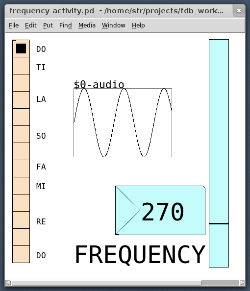

Day 1
=====

Topics
------

* The Human Voice
* Ears and Hearing
* Vibration
* Air Pressure

Demo
----

Take a straw. blow into it to demonstrate that it doesn't make sound on its
own.  Then flatten one end about an inch and cut off the sides at a shallow
angle, so you make 2 flaps that act like an oboe reed. Now put your lips on the
"reed" and demonstrate that now you can make sound.

TODO: we probably should have a picture here

Activity
--------

Open the included "frequency activity.pd" patch in Pure Data, or PD (shown
below). Clicking on The boxes on the left will play that pitch. The slider on
the right can be moved, and the students can hear a continuum of pitches, as
well as visualizing the waveform and seeing the frequency as a number.

Ask the students to find the pitches of each solfege note (Do, Re, Mi, etc.) by
listening to the tone generated by the buttons on the left and matching the
frequency using the slider on the right.
