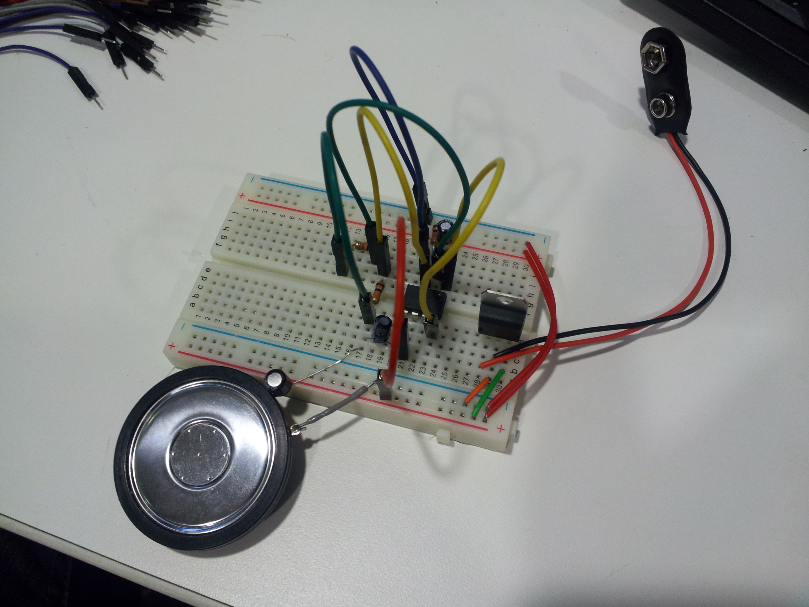
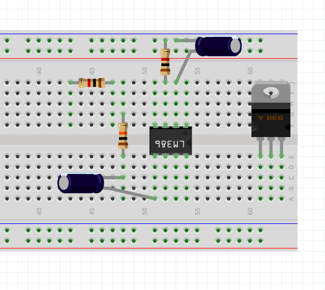
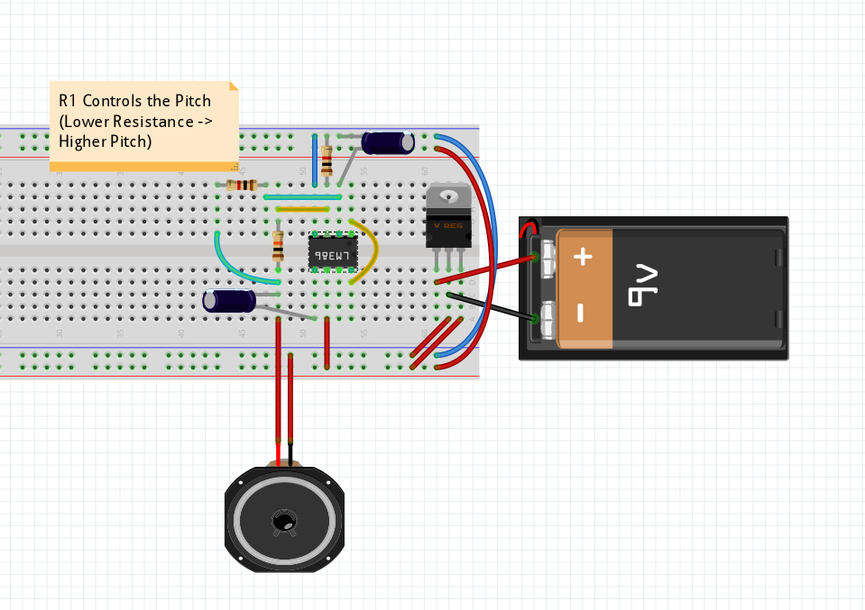
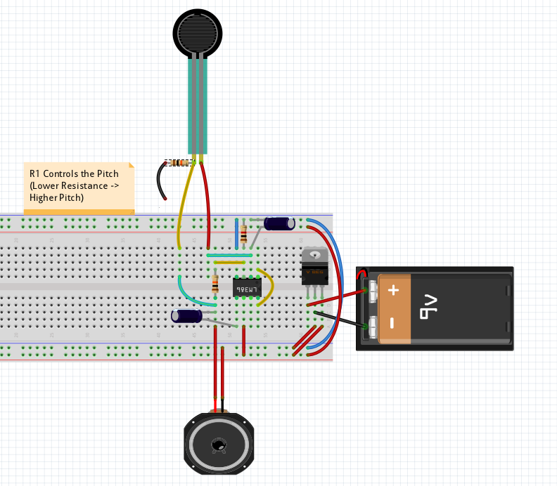

Day 2: Building a Simple Oscillator
===================================

This lesson builds on the acoustic principles from Day 1 and introduces some
basic electronics concepts. In the activity the students build a simple
oscillator circuit that can generate sound.

Topics
------

* Electricity
* Batteries
* Voltage
* Current
* Resistance
* Speakers
* Electronic Components

Activity
--------

The finished oscillator

For this activity each student or group will need

* 1 Breadboard
* 1 LM7805 Voltage Regulator
* 1 LM386 Op-Amp
* 3 10uF Electrolytic Capacitors
* 1 (Very) Small Speaker
* 1 9V Battery Connector
* 1 9V Battery
* 1 Set Breadboard Jumper Cables
* 2 10K Resistor
* 2 1K Resistors

There should also be an assortment of resistive sensors (presure, light, etc.)
available as well.

To reduce confusion, especially if the students are on the younger side, it's
it's helpful to distribute the components as needed for each step, so you can
check their work along the way, expecially before they apply power.

### Step 1: Components

Distribute the breadboard and all components excluding the battery. Place the
components as in the following picture.

### Step 2: Wires

Once the students have placed all the components, check their work and
distribute the wires. They should be placed according to the following picture.
As mentioned above it's probably best to distribute the batteries only after
you've verified that the parts and wires are placed correctly.

### Step 3: Power

After the wires are placed correctly, give them the battery so they can power
up the oscillator and hear the results.

### Step 4 Sensors

The frequency of the oscillator is determined by the 1K resistor that is
between the green wires. Have the students swap it out for a 10K. What is the
relationship between the resistance and the frequency?

Now plug in the sensors as in the below picture. Note that the sensors have
been modified with an additional resistor. For now leave that wire unconnected,
as it is used in a later activity. Based on your answer to the previous
question, what is the relationship between the property being sensed (pressure,
light, etc.) and the resistance of the sensor?

