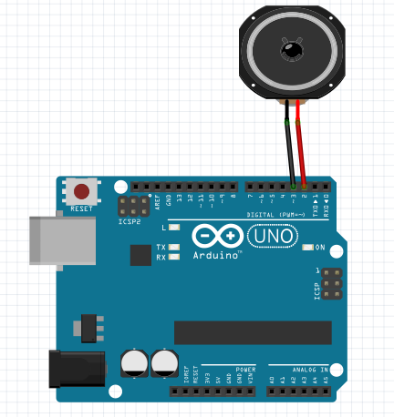

Day 3: Arduino!
===============

Here we introduce the concept of programming as a detailed set of instructions
or a recipe for a computer to follow. We create an oscillator that duplicates
the functionality of Day 2, but in code. We then go on to show how it's much
easier to add features to software than hardware.

Topics
------

* Computer
* Program
* Input
* Output
* Digital High/Low
* setup() and loop() functions

Activity
--------

For this activity each student or group will need

* 1 Arduino
* 1 USB Cable
* 1 Computer with Arduino IDE installed
* 1 Speaker with in-line 10uF capacitor for DC blocking

A selection of sensors should be available for the students to swap around.
The sensors should be set up as voltage dividers, i.e. if it is a simple
resistive sensor, then you'll need to add an extra resistor to form the
other half of the divider.

### A Simple Fixed Oscillator

First walk the students through the basic parts of the program in
`simple_tone.ino`, including each function call used in the program.

    void setup()
    {
      pinMode(2, OUTPUT);
      digitalWrite(2, LOW);
      pinMode(3, OUTPUT);
      digitalWrite(3, LOW);

      tone(3, 220);
    }

Have the students plug a speaker (the same one used in Day 2) into pins 2 and 3
of the Arduino. Pins 3 and ground could also be used, but it may be easier to
plug in the speaker using adjacent pins. Ask them to press the "Upload" button
in the Arduino IDE to compile the program and transfer it to the Arduino.

They should now hear a 220Hz tone from the speaker. Ask them to try to set the
frequency to a particular note from the PD patch used in Day 1.

### Sensor Input

Now open `sensor_tone.ino`. Have the students conncect the sensors. The black
wire should connect to Ground, the Red wire to 5V, and the Orange with to the
A0 ADC input.

Have the students load the sketch to the Arduino and try it out. In our
workshop we didn't have time to go into the details of this program, so it is
more of a hands-on demo.
